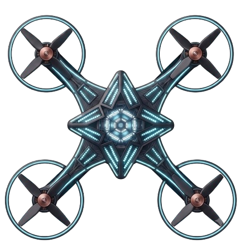

<p align="center">
  
</p>

<h1 align="center">Drone Sim Master</h1>

<p align="center">
  A physics-accurate, multi-drone simulation built in <strong>Godot 4.6</strong> — with MAVLink/ArduPilot integration, swarm AI, VR support, and Docker-based deployment.
</p>

<p align="center">
  
  
  
  
</p>

---

## Overview

**Drone Sim Master** is a full-stack drone simulation environment composed of two projects:

| Project | Description |
|---|---|
| `Godot-drone-master/` | The Godot 4.6 simulation — physics, flight model, swarm AI, terrain, VR |
| `MavLink/MavLink-Bridge/` | A Python UDP bridge connecting the sim to ArduPilot / Mission Planner |

The simulation models a **DJI Mini 4K-inspired quadcopter** with realistic battery drain, wind turbulence, stabilisation, and multi-layer terrain. It supports flying in **single-drone manual mode**, **autopilot waypoint mode**, **swarm mode** (up to 39 boids-driven drones in formations), and **VR (OpenXR)** mode.

---

## Features

- ✈️ **Realistic flight physics** — throttle, pitch, roll, yaw with input smoothing, hover hold, tilt limits, and ground clearance
- 🌬️ **Wind & turbulence** — multi-frequency turbulence layers (fast jitter, medium sway, slow drift) with gusts
- 🔋 **Battery simulation** — ~20 min flight life, aggressive-maneuver drain multiplier, low-battery RTL and auto-land
- 🤖 **Swarm AI** — 39 boids-based drones with cohesion, separation, alignment, and named formation modes (Star, Circle, Heart, Diamond, Wave)
- 🛩️ **Autopilot** — configurable waypoint list with smooth navigation
- 🔗 **MAVLink integration** — two-way UDP bridge to ArduPilot/SITL or Mission Planner; RC channel override and telemetry forwarding
- 🥽 **VR / OpenXR** — first-person VR flight via any OpenXR-compatible headset
- 🌍 **Procedural world** — Terrain3D plugin, town generator, day/night environments, minimap
- 🐳 **Docker-ready** — fully containerised Godot headless sim + Python bridge

---

## Repository Layout

```
Drone-Sim-Master/
├── Godot-drone-master/        # Godot 4.6 project
│   ├── scenes/                # Main, Drone, Menu, Terrain, Environment scenes
│   ├── scripts/               # GDScript — Drone.gd, DroneControllerManager.gd,
│   │                          #   SwarmController.gd, MavlinkBridge.gd, ...
│   ├── assets/                # Textures, environment HDR, 3-D models
│   ├── addons/terrain_3d/     # Terrain3D plugin
│   ├── Dockerfile             # Godot headless container (Ubuntu 24.04 + Godot 4.6.2)
│   └── docker-compose.yml     # Local compose file for the Godot service only
├── MavLink/
│   └── MavLink-Bridge/        # Python MAVLink <-> Godot UDP bridge
│       ├── Bridge.py          # Main bridge script
│       ├── requirements.txt   # pymavlink
│       └── Dockerfile
└── docker-compose.yml         # Top-level compose — sim + bridge (+ optional Mission Planner)
```

---

## Getting Started

### Prerequisites

| Tool | Version | Notes |
|---|---|---|
| [Godot 4](https://godotengine.org/download) | 4.6+ | For local editing / running |
| [Python](https://python.org) | 3.9+ | For running the MAVLink bridge natively |
| [Docker Desktop](https://www.docker.com/products/docker-desktop/) | Latest | For containerised setup |
| [ArduPilot SITL](https://ardupilot.org/dev/docs/sitl-simulator-software-in-the-loop.html) | Any | Only needed for MAVLink integration |

---

### Option A — Run locally in Godot (quickest)

1. **Clone the repo**
   ```bash
   git clone https://github.com/YOUR_ORG/Drone-Sim-Master.git
   cd Drone-Sim-Master
   ```

2. **Open the Godot project**
   - Launch **Godot 4.6+**
   - Click **Import** → navigate to `Godot-drone-master/` → select `project.godot`
   - Let the editor import assets (first run may take a minute)

3. **Press Play (F5)**
   - The main menu opens. Choose a mode:
     - **Single Drone** — manual flight with keyboard
     - **Swarm** — 39 drones in boids formation
     - **Autopilot** — waypoint navigation demo

4. **Controls (keyboard)**

   | Key | Action |
   |---|---|
   | `Space` | Throttle up |
   | `Shift` | Throttle down |
   | `W / S` | Pitch forward / back |
   | `A / D` | Strafe left / right |
   | `Q / E` | Yaw left / right |
   | `H` | Toggle hover-hold |
   | `F` | Toggle first-person / third-person camera |
   | `Tab` | Cycle swarm formations (in swarm mode) |

---

### Option B — Docker Compose (headless sim + bridge)

This runs Godot in **headless mode** alongside the Python MAVLink bridge.

1. **Clone the repo** (same as above)

2. **Build and start all services**
   ```bash
   docker compose up --build
   ```
   This starts:
   - `drone-sim` — Godot 4.6.2 running headless
   - `mavlink-bridge` — Python bridge listening for ArduPilot on UDP `14550`

3. **Connect ArduPilot SITL** (on the host machine)
   ```bash
   # Start ArduCopter SITL targeting the bridge's MAVLink port
   sim_vehicle.py -v ArduCopter --out udp:127.0.0.1:14550
   ```

4. **Verify telemetry**
   The bridge console will print forwarded messages like:
   ```
   Connected to system 1, component 1. Forwarding telemetry to 127.0.0.1:14551
   Forwarded ATTITUDE: {'roll': 0.01, 'pitch': -0.02, 'yaw': 1.57, ...}
   ```

5. **Stop services**
   ```bash
   docker compose down
   ```

---

### Option C — MAVLink bridge only (native Python)

Use this when running the Godot sim locally but wanting to connect to ArduPilot or Mission Planner.

```bash
cd MavLink/MavLink-Bridge
pip install -r requirements.txt

# Default ports
python Bridge.py

# Custom ports
python Bridge.py \
  --mavlink-bind 127.0.0.1 \
  --mavlink-port 14550 \
  --godot-host 127.0.0.1 \
  --godot-port 14551 \
  --control-port 14552
```

Then in the Godot scene:
1. Select the `DroneControllerManager` node in the **Main** scene
2. Enable `use_mavlink_bridge = true`
3. Set `mavlink_listen_port` to `14550` (must match `--mavlink-port`)
4. Set `mavlink_remote_host / mavlink_remote_port` to where the bridge forwards telemetry

---

## MAVLink Bridge — Port Reference

| Port | Direction | Purpose |
|---|---|---|
| `14550` | ArduPilot → Bridge | MAVLink telemetry input |
| `14551` | Bridge → Godot | JSON telemetry forwarded to sim |
| `14552` | Godot → Bridge | JSON control inputs (Throttle/Yaw/Pitch/Roll) |

Control packets from Godot use normalised axes (`-1.0 … 1.0`); the bridge converts them to PWM (`1000–2000`) and sends MAVLink `RC_CHANNELS_OVERRIDE`.

---

## VR (OpenXR)

OpenXR is enabled in the project settings. To fly in VR:

1. Start an OpenXR runtime on your machine (e.g. SteamVR, Monado)
2. Launch the project normally — Godot will detect the active runtime and enable the `VRManager` automatically

---

## Project Architecture

```
+---------------------+        UDP JSON         +----------------------+
|   Godot Sim         |<----- telemetry --------|                      |
|  (Drone.gd)         |                          |   Bridge.py          |
|  (MavlinkBridge.gd) |---- RC controls ------->|  (Python / pymavlink)|
+---------------------+                          +----------+-----------+
                                                            |  MAVLink UDP
                                                            v
                                                  +----------------------+
                                                  |  ArduPilot SITL /    |
                                                  |  Mission Planner     |
                                                  +----------------------+
```

---

## Development Notes

- The Godot project targets **Forward Plus** rendering at 1920×1080 / 60 fps
- The `Terrain3D` plugin must be present in `addons/terrain_3d/` (already committed)
- Wind and battery constants live at the top of `Godot-drone-master/scripts/Drone.gd` for easy tuning
- Swarm formation names (`star`, `circle`, `heart`, `diamond`, `wave`) are registered in `Godot-drone-master/scripts/DroneControllerManager.gd`

---

## License

MIT — see `LICENSE` if present, or add one as needed.
